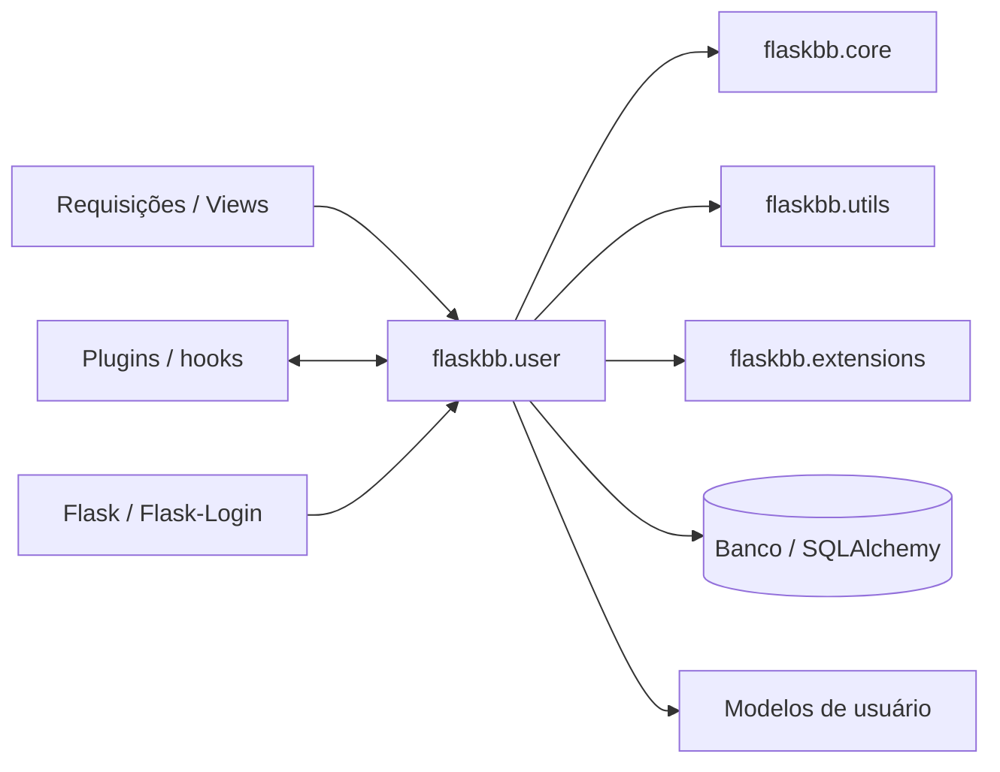

# Análise do módulo `flaskbb.user` como sistema legado

## Dependências internas e externas

Uma coisa que ficou mais clara para mim durante as Partes 1 e 2 é que o módulo `user` depende de várias camadas ao mesmo tempo. Entre as dependências internas que apareceram no código analisado estão `core.changesets`, `core.exceptions`, `extensions`, `utils.database` e `utils.helpers`. Externamente, aparecem principalmente Flask, Flask-Login, SQLAlchemy, `attrs`, `pluggy`, Babel e `requests`.

No sentido contrário, o módulo também é usado pelas partes do sistema que precisam consultar dados de usuário ou iniciar operações relacionadas à conta. As views funcionam como uma das principais portas de entrada e os hooks fazem a ligação com extensões/plugins.

O diagrama é propositalmente de alto nível. Minha intenção foi mostrar as conexões diretas encontradas durante a análise, e não tentar representar toda a arquitetura do FlaskBB.

## Acoplamento e coesão

### 1. Alto acoplamento nas factories

`services/factories.py` conhece `current_app`, `current_user`, `db`, `pluggy`, helpers de idioma/tema, formulários e handlers. Isso torna as factories convenientes para montar os objetos, mas também faz com que conheçam muitos detalhes do ambiente. Nos testes dessa área foi necessário controlar dependências justamente para verificar as interações sem depender de todo o estado real da aplicação.

### 2. Alto acoplamento nos handlers de atualização

Em `services/update.py`, uma alteração envolve changesets, validadores, sessão do banco, `try_commit` e hooks de plugins. O fluxo é compreensível, mas alterar uma dessas etapas pode afetar as demais. Foi por isso que, na Parte 2, preferi fazer refatorações pequenas e executar a suíte depois de cada mudança.

### Ponto de baixa coesão: `models.py`

O arquivo `models.py` foi o que mais chamou minha atenção em tamanho durante a análise inicial: na baseline ele concentrava 246 statements medidos pelo coverage e uma quantidade grande de linhas não executadas. Um arquivo de modelos naturalmente concentra regras de domínio e persistência, mas, neste caso, a quantidade de responsabilidades reunidas torna a leitura e a manutenção mais difíceis. Para mim, esse é um sinal de coesão menor do que seria desejável.

## Pontos de fragilidade

### 1. Estado global do Flask

O uso de `current_user` e `current_app` simplifica o código, mas cria dependência do contexto da aplicação. Uma função pode parecer pequena e ainda assim precisar de um contexto Flask válido para funcionar. Isso aumenta o cuidado necessário nos testes e em futuras extrações.

### 2. Persistência misturada ao fluxo de atualização

Os handlers aplicam a alteração e logo chamam `try_commit(self.db.session, ...)`. A regra da operação e a decisão de como persistir continuam próximas. Uma mudança de ORM ou uma estratégia diferente de persistência atingiria diretamente essa área.

### 3. Cobertura ainda baixa em partes importantes

Na Parte 1, a suíte completa passou de 232 testes aprovados para 252, com 1 ignorado. Mesmo assim, a cobertura mostrou que ainda existe bastante código não exercitado, especialmente em `models.py`, `forms.py` e alguns caminhos das views. Isso não significa que o código esteja incorreto, mas aumenta o risco de alterar um comportamento que não está protegido por um teste específico.

## Lei de Lehman

A lei de Lehman que mais consegui relacionar com o módulo foi a da complexidade crescente. O código não parece ter ficado complexo por uma única decisão ruim; ele foi acumulando responsabilidades necessárias para um sistema de fórum: perfil, configurações, plugins, validações e persistência. O próprio cabeçalho de arquivos de serviços registra código de 2018, e a contagem que fiz durante a baseline mostrou 1.283 linhas somando os arquivos analisados do módulo. Na prática, percebi essa complexidade quando uma alteração pequena precisava considerar framework, banco, plugins e testes. Também vejo relação com a mudança contínua: funcionalidades de usuário precisam acompanhar novas necessidades do sistema e, sem refatorações periódicas, a tendência é que essas conexões aumentem.

## Seams identificáveis

### Seam 1 — persistência

Um seam natural seria introduzir uma interface de repositório entre os serviços e o acesso ao banco. Em vez de o handler conhecer diretamente a sessão utilizada para persistir a alteração, ele poderia depender de uma abstração. Em teste, essa abstração poderia ser substituída por uma implementação em memória ou mock; em produção, continuaria usando SQLAlchemy.

### Seam 2 — coleta de validadores/plugins

Outro ponto é a coleta de validadores via `pluggy`. A função `_collect_validators` que extraí na Parte 2 já deixou essa fronteira mais visível. O próximo passo poderia ser fazer os handlers receberem uma fonte de validadores por contrato, permitindo substituir os validadores em testes sem depender do mecanismo real de plugins.

## Conclusão

O que mais mudou na minha leitura do módulo foi perceber que “legado” não significa simplesmente código antigo ou ruim. O `user` funciona e possui uma suíte relevante, mas carrega decisões e dependências acumuladas ao longo do tempo. Para evoluí-lo com segurança, eu evitaria uma reescrita grande e priorizaria criar fronteiras mais claras em volta das dependências que hoje tornam as mudanças mais arriscadas.
