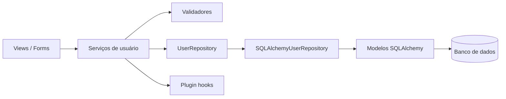

# Proposta de evolução do módulo `flaskbb.user`

## Proposta escolhida

Minha proposta é introduzir progressivamente uma **camada de repositórios para isolar o SQLAlchemy e o acesso à persistência** no módulo `user`.

## Motivação

Depois de trabalhar com testes e refatorações, o ponto que mais me incomodou não foi uma função específica, mas a proximidade entre regra de aplicação e infraestrutura. Nos handlers de atualização, por exemplo, o fluxo valida os dados, modifica o usuário e persiste usando a sessão do banco. Isso funciona, mas faz com que uma operação de negócio saiba detalhes de como os dados são gravados.

A análise de legado também mostrou que `models.py` concentra bastante código e que o módulo depende diretamente de várias peças de infraestrutura. Por isso, eu não escolheria reescrever o `user` nem migrar de linguagem. Para o estado atual do projeto, isso me parece um risco desnecessário. Uma camada de repositórios é uma mudança menor e incremental: o SQLAlchemy continua existindo, mas deixa de ser uma dependência espalhada pelas regras que poderiam depender apenas de um contrato de persistência.

## Estado-alvo

### Novos artefatos

- `UserRepository`: contrato com as operações de persistência realmente necessárias ao módulo.
- `SQLAlchemyUserRepository`: implementação do contrato usando o ORM atual.
- Factory/configuração responsável por entregar o repositório adequado aos serviços.
- Dublês do repositório para testes unitários.
- Testes de integração para confirmar que a implementação SQLAlchemy respeita o contrato.

Eu evitaria criar um repositório genérico enorme. O contrato deveria nascer das necessidades reais do módulo `user`, com métodos pequenos e ligados aos casos de uso existentes.

## Plano de migração incremental

### 1. Mapear os acessos atuais ao banco
**O que muda:** primeiro eu levantaria quais operações do módulo consultam ou persistem usuários e quais realmente precisam entrar no contrato.

**Como continua funcionando:** nenhuma chamada seria substituída ainda. O código de produção continuaria como está.

**Como verificar:** suíte atual completa e conferência do levantamento com os caminhos já exercitados pelos testes.

### 2. Criar o contrato `UserRepository`
**O que muda:** seria criada a abstração com apenas as operações necessárias para o primeiro caso de uso escolhido.

**Como continua funcionando:** criar o contrato não remove o acesso atual ao SQLAlchemy, então o comportamento existente permanece.

**Como verificar:** testes unitários do contrato e execução da suíte.

### 3. Implementar `SQLAlchemyUserRepository`
**O que muda:** a implementação passa a encapsular as operações selecionadas, ainda usando os mesmos modelos e a mesma persistência do FlaskBB.

**Como continua funcionando:** por baixo da nova interface, o mecanismo continua sendo SQLAlchemy. Não existe migração de dados nem troca de banco.

**Como verificar:** testes de integração comparando a implementação com o comportamento atual e execução da suíte completa.

### 4. Migrar um fluxo pequeno primeiro
**O que muda:** eu começaria por uma operação bem delimitada. Um handler passaria a receber o repositório e deixaria de conhecer diretamente a sessão naquele ponto.

**Como continua funcionando:** os demais handlers continuam no caminho antigo. Somente o fluxo escolhido usa a abstração nova.

**Como verificar:** testes existentes, novos testes com repositório falso/mock e teste de integração com a implementação SQLAlchemy.

### 5. Migrar os demais fluxos gradualmente
**O que muda:** depois de validar o primeiro caso, os outros acessos seriam migrados um por vez.

**Como continua funcionando:** durante a transição, código antigo e novo podem coexistir. Não é necessário um “big bang”.

**Como verificar:** a cada migração, testes específicos, suíte completa e acompanhamento da cobertura.

### 6. Remover dependências diretas que ficaram obsoletas
**O que muda:** somente depois de os consumidores relevantes estarem usando o repositório seriam removidos acessos diretos que não fossem mais necessários.

**Como continua funcionando:** essa etapa só acontece quando o novo caminho já estiver validado.

**Como verificar:** busca por usos antigos, suíte completa e testes de integração do repositório.

## Riscos e mitigações

### Risco 1 — criar apenas uma camada extra sem reduzir acoplamento
É possível criar um `Repository` que simplesmente copie todas as operações do ORM. Para evitar isso, eu definiria o contrato a partir dos casos de uso e não de todos os métodos disponíveis no SQLAlchemy.

### Risco 2 — comportamento diferente durante a transição
Consultas ou commits podem ter detalhes que não aparecem em um teste unitário. A mitigação seria migrar um fluxo por vez e manter testes de integração usando a implementação SQLAlchemy real.

### Risco 3 — duas formas de persistência coexistirem por tempo demais
Durante a migração haverá código usando o caminho antigo e código usando o repositório. Se isso durar indefinidamente, a arquitetura fica ainda mais confusa. Eu manteria uma lista explícita dos fluxos pendentes e encerraria a migração removendo os acessos diretos planejados.

## Fora do escopo

Esta proposta não inclui trocar o banco de dados, remover SQLAlchemy, reescrever todo o módulo `user`, migrar o FlaskBB para outra linguagem ou transformar o módulo em um microsserviço. Também não proponho alterar regras de autenticação ou comportamento visível para o usuário. O objetivo é criar uma fronteira melhor para persistência mantendo o funcionamento atual.

## Consideração final

Escolhi uma evolução relativamente conservadora de propósito. Depois da experiência da Parte 2, achei mais coerente continuar com mudanças pequenas e verificáveis do que propor uma arquitetura completamente nova. A vantagem é que cada passo pode ser corrigido ou revertido sem exigir que o módulo inteiro seja migrado de uma vez.
